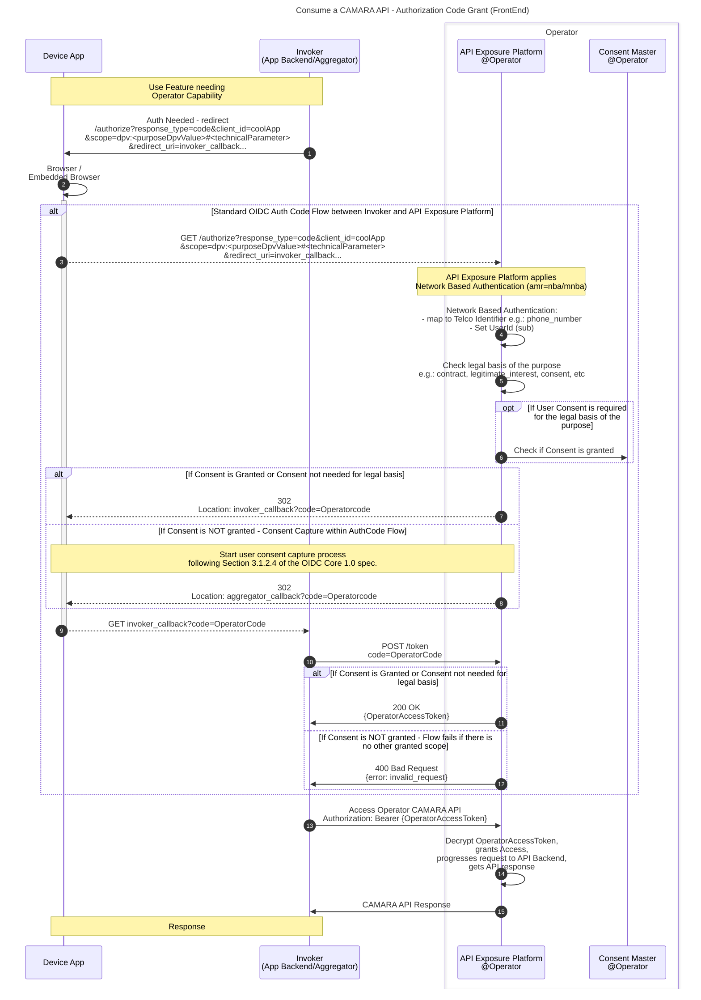
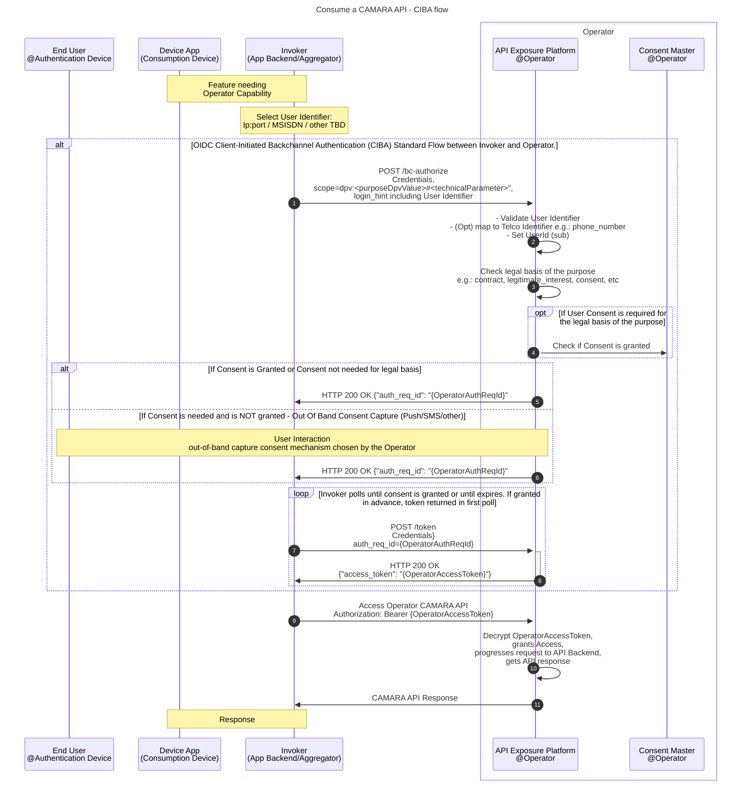

# CAMARA APIs access and user consent management

This document defines guidelines for telco operator exposure platforms to manage CAMARA API access and user consent (when applicable).

## Table of Contents

- [CAMARA APIs access and user consent management](#camara-apis-access-and-user-consent-management)
  - [Table of Contents](#table-of-contents)
  - [Introduction](#introduction)
  - [Glossary of Terms and Concepts](#glossary-of-terms-and-concepts)
  - [Purposes](#purposes)
    - [Purpose definition](#purpose-definition)
    - [Applying purpose concept in the authorization request](#applying-purpose-concept-in-the-authorization-request)
  - [User Identity](#user-identity)
  - [User Authentication/Authorization \& Consent Management](#user-authenticationauthorization--consent-management)
    - [Authentication mechanism/s](#authentication-mechanisms)
    - [Consent capture and storage](#consent-capture-and-storage)
    - [Authorization flows / grant types](#authorization-flows--grant-types)
      - [Authorization code flow (Frontend flow)](#authorization-code-flow-frontend-flow)
      - [CIBA flow (Backend flow)](#ciba-flow-backend-flow)
      - [Client Credentials](#client-credentials)
  - [CAMARA API Specification - Authorization and authentication common guidelines](#camara-api-specification---authorization-and-authentication-common-guidelines)
    - [Use of openIdConnect for `securitySchemes`](#use-of-openidconnect-for-securityschemes)
    - [Use of `security` property](#use-of-security-property)
    - [Mandatory template for `info.description` in CAMARA API specs](#mandatory-template-for-infodescription-in-camara-api-specs)


## Introduction

Some APIs process personal information and require a “legal basis” to do so (e.g. “legitimate interest”, “contract”, “consent”, etc). Telco operator exposure platforms implementing CAMARA should be built with a privacy-by-design approach to fully comply with data protection regulations, such as the [GDPR regulation](https://gdpr-info.eu/) in Europe, to protect user privacy. This means that a CAMARA API exposed to capability consumers that processes personal data may require user consent (explicit user opt-in), depending on the "legal basis" for processing that data. This consent is given by users to legal entities to process personal data under a specific purpose.

As per CAMARA ["Authentication and Authorization Concept for Service APIs"](https://github.com/camaraproject/IdentityAndConsentManagement/blob/main/documentation/CAMARA-AuthN-AuthZ-Concept.md), CAMARA API access will be secured using [OpenID Connect](https://openid.net/connect/) on top of OAuth 2.0 protocol. This document defines guidelines for operator exposure platform to manage CAMARA API access and user consent to comply with GDPR or equivalent requirements in an easy way, introducing the concept of "purpose" in CAMARA APIs access. Even being defined based on concepts that maps to GDPR regulation, proposed solution and concepts are generic enough to be used by operators on any country.

The document details aspects regarding CAMARA APIs access and the user consent management, which includes following concepts:

- User identity. How to identify the user.
- User authentication and authorization. How to authenticate the user and how to authorize access to CAMARA APIs.
- How to apply the concept of "purpose" in CAMARA APIs access.
- How to capture and store user consent (when required by the legal basis applied).
- Policy enforcement to validate existence and validity of consent before authorizing access to a (set of) resources.
- User consent revocation.
- Flows detailing CAMARA APIs access and how consent can be collected from the user without degrading the user experience while using a third-party service in an application.

>[TO BE EDITED/COMPLETED]

## Glossary of Terms and Concepts

The list below introduces several key concepts:

-	`Application`: client system that requires access to protected resources. Application must use the appropriate access token to access those resources (e.g. CAMARA Network APIs).
-	`End User`: the human participant who uses the application from a consumption device. 
- `User`: the client/subscriber of the telco operator, identified by a unique user identifier (e.g. subject identifier sub in OpenID Connect terminology). The user is the resource owner. Usually the user corresponds to the end user, but this is not always the case. For example, a parent may be the user of a mobile subscription for their children.
-	`Auth Server`: authorization server which receives requests from applications to issue an access token upon successful authentication and consent of the user. The OpenID Connect provider is able to authenticate the user validating user identity against the corresponding identity provider. The authorization server exposes two endpoints: the authorization endpoint and the token endpoint.
-	`Identity Provider (IdP)`: It corresponds to the OpenID identity provider which is the party that provides user authentication as a service (it creates, maintains, and manages user identity information). 
-	`Resource Server`: A server that protects the user resources and receives access requests from applications. It accepts and validates an access token from the application and returns the appropriate resources to it.
-	`Scope`: OpenID Connect scope name which maps one or more resources. Some scopes may refer to personal information that could be affected by data protection regulations that require identifying the purpose for which they are requested.
-	`Data processing`: storing, transforming, or accessing personal information is considered processing data. Third party clients will be data processors, while the telco operator will be the data controller.
-	`Purpose`: The reason for which processing that personal information is required by the application. For example, an application might want to handle personal information to create a movie recommendation for a user. This is equivalent to the term purpose mentioned in GDPR law; for example, [Art. 5 of the law](https://gdpr-info.eu/art-5-gdpr/) states the following: “Personal data shall be […] collected for specified, explicit and legitimate **purposes**”. Additionally, personal data is translated into personal information resources, as explained below.
-	`Consent`: an explicit opt-in action that the user takes to allow processing of their personal information. It grants a **legal** entity (e.g., the operator or a specific third party) access to a set of **scopes** of a given **user**, under a specific **purpose**.
-	`Legal Entities`: are the legal subjects that are willing to get access to personal information with a specific, predefined purpose.
- `Operator`: Mobile Network Operator (MNO), or CSP/telco operator, exposing network capabilities via standard CAMARA APIs.
- `Aggregator`: aggregate Operator’s CAMARA standardised APIs for building services offered to application developers. An aggregator can be a hyperscaler (e.g. Vonage, AWS, Azure, Google Cloud) offering its own services or directly exposing CAMARA APIs available at the operators, or it can be a telco operator acting as an aggregator, i.e.: aggregating other telco operators and exposing CAMARA APIs available at these telco operators.
- `API Exposure Platform`: Operator's platform for exposing network capabilities via standard CAMARA APIs. It is the platform that exposes the CAMARA APIs to application developers and provides the authentication and authorization mechanisms to access them. It is also responsible for consent management. It typically consists of at least an Auth Server and an API Gateway.

>[TO BE EDITED/COMPLETED]

## Purposes

A purpose declares what the application intends to do with a set of personal information resources...

>[TO BE EDITED/COMPLETED]

### Purpose definition

>[TO BE EDITED/COMPLETED] - purpose definition (naming + description) and format. Data privacy vocabulary: https://www.w3.org/community/dpvcg/​ | https://w3c.github.io/dpv/dpv/#vocab-purpose

### Applying purpose concept in the authorization request

A purpose must be declared within the requested scope for the following grant types:
- authorization_code
- urn:openid:params:grant-type:ciba

No purpose is required for the client_credentials grant type, as this grant type can only be used when no personal user data is processed. The requested scope must be set directly to the value defined for the relevant endpoint within the OAS ("YAML") specification. "Wild card" scopes (i.e. specifying only the API name) are not valid for this grant type.

In order to declare a purpose when accessing the CAMARA APIs, it is strongly recommended that the `scope' parameter is set to:

`dpv:<dpvValue>#<technicalParameter>`

- `<dpvValue>` is coming from [W3C DPV purpose definition](https://w3c.github.io/dpv/dpv/#vocab-purpose)
- `<technicalParameter>` must be either:
  - one **technical scope** to limit the request to one API endpoint (this technical scope is described in the API spec YAML file)
  - one **API name** to cover the complete API (This API name is not described in the API spec YAML file as technical scope) – In this case the request covers all technical scopes of the API.

<br>

The examples are provided below:

Strong recommendation for format samples:

```
dpv:FraudPreventionAndDetection#retrieve-sim-swap-date

dpv:FraudPreventionAndDetection#check-sim-swap

dpv:FraudPreventionAndDetection#sim-swap (*)
```
_(*)Use api name when all scopes are included_

Strongly discourage the below formats and they do not guarantee interoperability:

```
dpv:FraudPreventionAndDetection#scope1 (legal-base1) scope2 (legal-base2)
dpv:FraudPreventionAndDetection#scope1 scope2 (one legal base)*
```
_(*)Can be re-opened as an issue later for discussion_

>NOTE: Purpose (dpv) to be added as custom claim and other such options for purpose will be discussed with OIDF after they have finalized the formal liaison with CAMARA. They will be asked to provide recommendation as a neutral and OIDF expert party here for this topic*.<br>
(*)_Can be opened as an issue later_

## User Identity

>[TO BE EDITED/COMPLETED] - User identification: Get an identifier for a user from some information. E.g.: IP, phone number, document number...

## User Authentication/Authorization & Consent Management

>[TO BE EDITED/COMPLETED] - The base standard is OpenID Connect (OIDC). <br>User authentication: Verify that the user is who they say they are. For example: IP/Network authentication, SMS OTP, User/Password, Push to operator application... it depends on the type of authorization (grant type) chosen according to the application use cases, integration model and requirements (B2B/B2C, via aggregator or not...).<br>User authorization: Verify access to the requested resource (OpenID Connect scope, purpose) through policies and rules... user consent is checked at this point as a pre-requisite before issuing an access token.

### Authentication mechanism/s

>[TO BE EDITED/COMPLETED] - Authentication mechanism/s to be considered... E.g.: IP/Network authentication, SMS OTP, User/password, Push to operator application​...

### Consent capture and storage

>[TO BE EDITED/COMPLETED] - Consent capture by operator and storage in operator (consent master).

### Authorization flows / grant types

Detailed information on the below specified grant types (for eg. extensions to some of the grant types, links to original RFC documents etc.) is available in [CAMARA-AuthN-AuthZ-Concept.md](https://github.com/camaraproject/IdentityAndConsentManagement/blob/main/documentation/CAMARA-AuthN-AuthZ-Concept.md)

#### Authorization code flow (Frontend flow)



<br>

**Flow description**:

First, the API invoker (which could potentially be the application backend, an aggregator, etc.) instructs the application frontend in the device to initiate the OIDC authorization code flow with the operator. The authorization request includes the client_id of the final application requesting access to the data and the application redirect_uri (invoker_callback) where the authorization code will be sent.

As per the standard authorization code flow, the device application is redirected to the operator authorization endpoint in API exposure platform (Steps 1-2), providing a redirect_uri (invoker_callback) pointing to the invoker backend (where the auth code will eventually be sent), as well as the purpose for accessing the data.

The API exposure platform receives the request from the device application (Step 3) and does the following:

- Use network based authentication mechanism to obtain the user identifier, i.e.: MSISDN. Set the OAuth sub to the unique user ID in the operator (Step 4).

- Check if user consent is required, which depends on the legal basis associated with the purpose ("legitimate interest", "contract", "consent", etc). If necessary, it will check in the operator's consent master whether user consent has already been given for this identifier, the application client_id and the requested purpose (Steps 5-6).

Then, two alternatives may occur:

**Scenario 1**: User consent is not required or consent is already given (Step 7). The API exposure platform will continue the authorization code flow by redirecting to the API invoker redirect_uri (invoker_callback) and including the authorization code (OperatorCode).

**Scenario 2**: Consent is required and not yet provided by user (Step 8)

- The operator performs the consent capture following Section 3.1.2.4 of the OpenID Connect Core 1.0 specification. Since the authorization code grant involves the frontend, the consent can be captured directly from the user.
- Once the user has given consent, the authorization code flow continues by redirecting to the API invoker redirect_uri (invoker_callback) and including the authorization code (OperatorCode).

Once the API invoker receives the redirect with the authorization code (OperatorCode - Step 9), it will retrieve the access token from the operator's API exposure platform (OperatorAccessToken) (Steps 10-11). The OperatorAccessToken issued is encrypted so that no relevant information is exposed. If the user has not given consent, the access token will not contain the appropriate scopes, and if no other scopes are granted, the flow will fail.

Now the API invoker has a valid access token that can be used to invoke the CAMARA API offered by the operator (Step 12).

The operator's API exposure platform will validate OperatorAccessToken, grant the access to the API based on the scopes bound to the access token, progress request to the corresponding API backend and retrieve the API response (Step 13).

Finally, the operator will provide API response to the API invoker (Step 14).

<br>

**Technical ruleset for the Frontend flow**

The technical ruleset is applicable only after a subproject has agreed to use a 3-legged authentication flow. Every time personal user data is processed by an API and the user can exercise their rights either via opt-in and/or opt-out, 3-legged access tokens must be used. This ruleset provides a recommendation which will help API providers to align on the 3-legged flow and help with aggregation.

If all API usecases point to the need of On-net scenario and where the consumption device and authentication device are the same, the Frontend flow should be used. eg. NumberVerification

This flow is then applicable to On-net scenarios where the mobile connection of the device needs to be authenticated e.g. This flow is for example the one specified for the [CAMARA Number Verification API](https://github.com/camaraproject/NumberVerification/blob/main/documentation/API_documentation/assets/uml_v0.3.jpg) due to the nature of its functionality where a given MSISDN needs to be compared to the MSISDN associated with the mobile connection of the user device. 


The device application (front-end) must be able to handle browser redirects.

  - Identity: 
    - Identification by IP address (or header enrichment).
  - AuthZ/AuthN:
    - Standard OAuth 2.0 authorization code grant flow
    - Network based authentication.
      - Use network based authentication mechanism to obtain the user identifier, i.e.: MSISDN. Set the OAuth sub to the unique user ID in the operator.
    - 3-legged. **So that each access session is associated with the operator, a client_id (which must be the final application using the information) and the corresponding user identifier**.
  - Consent management:
    - Check if user consent is required by lawful basis associated with the declared purpose. 
      - If necessary, it will be checked **in the operator's consent master** whether user consent has already been given to the application for the user identifier and declared purpose.
    - If NOT granted, **the operator performs the consent capture**. Since the authorization code grant involves the interaction with application front-end, consent can be captured directly from the user through the application browser.
  - Covered scenarios:
    - On-net (with mobile connection) & application front-end (with embedded browser)
    - Off-net scenarios using refresh_token, as long as there was a connection when the first access_token was requested.


#### CIBA flow (Backend flow)



<br>

**Flow description**:

First, the API invoker (which could potentially be the application backend, an aggregator, etc.) requests a 3-legged access token to the operator API exposure platform. The process follows the OpenID Connect [Client-Initiated Backchannel Authentication (CIBA)](https://openid.net/specs/openid-client-initiated-backchannel-authentication-core-1_0.html) flow.

The API invoker has to provide in the authorization request (/bc_authorize) a login_hint with a valid user identifier together with the application credentials (the client_id of the final application requesting access to the data) and indicate the purpose for accessing the data (Step 1): 

- One option for the identifier is the public IP and (optionally – when applicable) port of the application. Other options could be the MSISDN or other identifiers. NOTE: In IoT scenarios or, in general, in those cases where the consumption device is different than the authorization device, the IP and port is the one of the consumption device for which the network capabilities will be requested/applied.
- The login_hint is a hint regarding the user for whom authentication is being requested. It has the format `<type>:<identifier>`, for instance, "ipport:" for IP addresses or "tel:+" for phone numbers. A login_hint example for MSISDN "+346xxxyyyzzz" looks like:

    ```
    POST /bc-authorize HTTP/1.1
    Authorization: Basic {Credentials}
    Content-Type: application/x-www-form-urlencoded

    login_hint=tel%3A%2B346xxyyyzzz&
    … 
    ```
- Purpose under which the personal data associated to API consumption will be processed.

The operator's API exposure platform will:

- Validate user identifier, map it to a telco identifier if applicable, e.g.: map IP to MSISDN. Set the OAuth sub to the unique user id in the operator (Step 2).

- Check if a user consent is needed, which depends on the legal basis associated to the purpose (“legitimate interest”, “contract”, “consent”, etc). If needed, it will check in the operator's consent master whether user consent has already been given for that identifier, the application client_id and the requested purpose (Steps 3-4).

Then, two alternatives may occur.

**Scenario 1**: User consent is not needed or consent is already granted (Step 5). API exposure platform will directly return a 200 OK response with the CIBA auth request identifier (auth_req_id=OperatorAuthReqId) to the API invoker. This is a unique identifier to identify the authentication request made by the invoker.

**Scenario 2**: Consent is needed and is not granted by the user yet (Step 6)

- A mechanism is triggered to capture user consent in the operator:
  
  - The operator triggers an out-of-band consent capture mechanism to interact with the user. **Operators can choose the consent capture mechanism that best suits their capabilities, preferences and needs**. This mechanism can be a push notification, an SMS, etc.
  - In parallel, the API exposure platform operator returns a 200 OK response with the CIBA auth request identifier (auth_req_id=OperatorAuthReqId) to the API invoker to indicate that the authentication request has been accepted and is going to be processed (Step 6).

<br>

Then, the API invoker polls the token endpoint by making an "HTTP POST" request by sending the grant_type (`urn:openid:params:grant-type:ciba`) and auth_req_id (OperatorAuthReqId) parameters (Step 7).
- The API invoker will receive the following error code if the authorization is still pending to be accepted or rejected by the user.
    
    ```
    HTTP/1.1 400 Bad Request
    Content-Type: application/json
    
    {
        "error": "authorization_pending",
    }
    ```
- When this response is received, the API invoker must wait the seconds of the `interval` value received in the CIBA authorization endpoint and then repeat the request until a final response is received.
- Once the user has granted consent, the API exposure platform operator will provide the access token (OperatorAccessToken) to the API invoker (Step 8). The OperatorAccessToken issued will be encrypted so no relevant information is disclosed.

<br>

Now the API invoker has a valid access token that can be used to invoke the CAMARA API offered by the operator (Step 9).

Finally, the operator will validate the OperatorAccessToken, grant access to the API based on the scopes bound to the access token, forward the request to the corresponding API backend and retrieve the API response (Step 10).

The operator will provide the API response to the API invoker (Step 11).

<br>

**Technical ruleset for the Backend flow**

The technical ruleset is applicable only after a subproject has agreed to use a 3-legged authentication flow. Every time personal user data is processed by an API and the user can exercise their rights either via opt-in and/or opt-out, 3-legged access tokens must be used. This ruleset provides a recommendation which will help API providers to align on the 3-legged flow and help with aggregation. 

If some usecase/s for an API point to off-net scenarios and where consumption and authentication devices could be different, the Backend flow should be used.

  - Identity: 
    - Identification by IP, MSISDN or others like IMSI, ICCID for specific use cases... it is open for more possibilities.
  - AuthZ/AuthN:
    - Standard OIDC backend-based flow: CIBA.
    - 3-legged. **So that each access session is associated with the operator, a client_id (which must be the final application using the information) and the corresponding user identifier**.
  - Consent management:
    - Check if user consent is required by lawful basis associated with the declared purpose. 
      - If necessary, it will be checked **in the operator's consent master** whether user consent has already been given to the application for the user identifier and declared purpose.
      - If NOT granted, **the operator’s consent capture procedure is triggered**. Out-of-band consent capture as part of asynchronous CIBA flow (e.g. push notification with fallback to SMS, etc...). **Operators can choose the consent capture mechanism that best suits their capabilities, preferences and needs**.
  - Covered scenarios:
    - No front-end developer software in user device
    - Back-end services (e.g. bank BE anti-fraud validation using MSISDN).
    - Off-net scenarios (no mobile connection)
    - Device connected to WiFi
    - Device without UI (IoT)

#### Client Credentials

The Client Credentials grant type is used to obtain a 2-legged access_token that does not represent a user. This grant type can only be used when no personal user data is processed, and it is only a valid option to access the CAMARA APIs for these specific scenarios. 

More details about the standard flow can be found in the official IETF specification [The OAuth 2.0 Authorization Framework](https://datatracker.ietf.org/doc/html/rfc6749#section-4.4).

## CAMARA API Specification - Authorization and authentication common guidelines

The purpose of this document section is to standardise the specification of `securitySchemes` and `security` across all CAMARA API subprojects with common mandatory guidelines as agreed by the Technical Steering Committee (TSC) and the participants of this Working Group.

CAMARA guidelines define a set of authorization flows which can grant API clients access to the API.
Which specific authorization flows are to be used will be determined during the onboarding process, happening between the API Client (the direct API invoker) and the API provider exposing the API. The API product order flow can consider the declared purpose for accessing the API, while also being subject to the prevailing legal framework dictated by local legislation and eventually also consider the capabilities of the application (frontend and backend) ultimately involved in the API invocation flow.
The possible authorization flows must be configured on the API product specification used to build the API product offering. This configuration could be purpose dependent. Note that as of now, there is a 1:1 relationship between a single API product offering and exposed Service API envisioned.
The authorization flow to be used will be settled when the API product is ordered. 
The API invoker is expected to initiate the negotiated authorization flow when requesting ID & access tokens. The AuthZ server is responsible to validate that the authorization flow negotiated between API Invoker and API provider for this application, purpose, API/data scopes is applied.

### Use of openIdConnect for `securitySchemes`

In general, OpenID Connect is the protocol to be used for securitization. Each API specification must ONLY define the following openIdConnect entry in `securitySchemes`, as shown in document [CAMARA-AuthN-AuthZ-Concept.md](https://github.com/camaraproject/IdentityAndConsentManagement/blob/main/documentation/CAMARA-AuthN-AuthZ-Concept.md#documentation-and-specs-):

```
components:
  securitySchemes:
    openId:
      type: openIdConnect
      openIdConnectUrl: https://example.com/.well-known/openid-configuration
```

The value for `openIdConnectUrl` in the CAMARA spec is an example, that must be substituted by the specific discovery endpoint for OIDC protocol of the API provider, when the API is exposed in one of its environments.

### Use of `security` property

Generally, each operation is protected by a scope and it will include a security property with a single element in the array:

```
paths:
  {path}:
    {method}:
      ...
      security:
        - openId:
            - {scope}
```
The key is arbitrary in OAS, but convention in CAMARA is to name it `openId`. This key must be same defined in the `components.securitySchemes` section.

The {scope} is the specific scope defined to protect this operation.

### Mandatory template for `info.description` in CAMARA API specs

The documentation template below must be used as part of the API documentation in  `info.description` property in the CAMARA API specs:


```
### Authorization and authentication

CAMARA guidelines defines a set of authorization flows which can grant API clients access to the API functionality, as outlined in the document [CAMARA-API-access-and-user-consent.md](https://github.com/camaraproject/IdentityAndConsentManagement/blob/main/documentation/CAMARA-API-access-and-user-consent.md). Which specific authorization flows are to be used will be determined during onboarding process, happening between the API Client and the Telco Operator exposing the API, taking into account the declared purpose for accessing the API, while also being subject to the prevailing legal framework dictated by local legislation.

It is important to remark that in cases where personal user data is processed by the API, and users can exercise their rights through mechanisms such as opt-in and/or opt-out, the use of 3-legged access tokens becomes mandatory. This measure ensures that the API remains in strict compliance with user privacy preferences and regulatory obligations, upholding the principles of transparency and user-centric data control.
```

It tells potential API customers why the API specification does not list specific grant types, and how to find out what authorization flows they can use.
