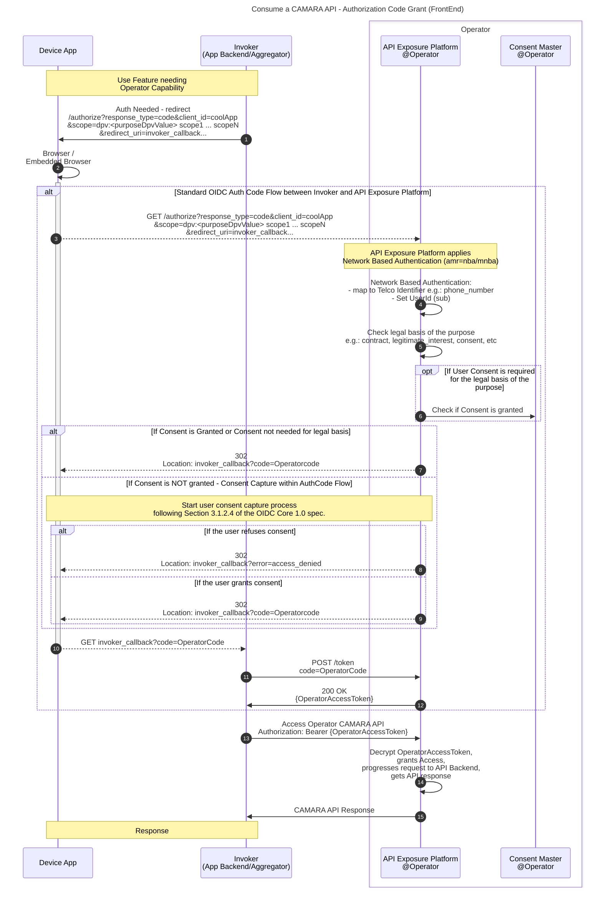

# CAMARA APIs Access and User Consent Management

This document defines guidelines for telco operator exposure platforms to manage CAMARA API access and user consent (when applicable).

## Table of Contents

- [CAMARA APIs access and user consent management](#camara-apis-access-and-user-consent-management)
  - [Table of Contents](#table-of-contents)
  - [Introduction](#introduction)
  - [Glossary of Terms and Concepts](#glossary-of-terms-and-concepts)
  - [Purposes](#purposes)
    - [Purpose definition](#purpose-definition)
    - [Applying purpose concept in the authorization request](#applying-purpose-concept-in-the-authorization-request)
  - [User Authentication/Authorization \& Consent Management](#user-authenticationauthorization--consent-management)
    - [Authorization flows / grant types](#authorization-flows--grant-types)
      - [Authorization Code Flow (Frontend Flow)](#authorization-code-flow-frontend-flow)
      - [CIBA flow (Backend flow)](#ciba-flow-backend-flow)
      - [Client Credentials](#client-credentials)
  - [CAMARA API Specification - Authorization and authentication common guidelines](#camara-api-specification---authorization-and-authentication-common-guidelines)
    - [Use of openIdConnect for `securitySchemes`](#use-of-openidconnect-for-securityschemes)
    - [Use of `security` property](#use-of-security-property)
    - [Mandatory template for `info.description` in CAMARA API specs](#mandatory-template-for-infodescription-in-camara-api-specs)


## Introduction

Some APIs process personal information and require a “legal basis” to do so (e.g. “legitimate interest”, “contract”, “consent”, etc). Telco operator exposure platforms implementing CAMARA should be built with a privacy-by-design approach to fully comply with data protection regulations, such as the [GDPR regulation](https://gdpr-info.eu/) in Europe, to protect user privacy. This means that a CAMARA API exposed to capability consumers that processes personal data may require user consent (explicit user opt-in), depending on the "legal basis" for processing that data. This consent is given by users to legal entities to process personal data under a specific purpose.

**CAMARA API access will be secured using [OpenID Connect](https://openid.net/specs/openid-connect-core-1_0.html) (OIDC) on top of [OAuth 2.0 protocol](https://datatracker.ietf.org/doc/html/rfc6749) following [the CAMARA Security and Interoperability Profile](CAMARA-Security-Interoperability.md)**. This document defines guidelines for operator exposure platform to manage CAMARA API access and user consent to comply with GDPR or equivalent requirements in an easy way, introducing the concept of "purpose" in CAMARA APIs access. Even being defined based on concepts that maps to GDPR regulation, proposed solution and concepts are generic enough to be used by operators on any country.

The document covers aspects regarding CAMARA APIs access and the user consent management, which includes following concepts:

- User identity. How to identify the user.
- User authentication and authorization. How to authenticate the user and how to authorize access to CAMARA APIs.
- How to apply the concept of "purpose" in CAMARA APIs access.
- How to capture and store user consent (when required by the legal basis applied).
- Policy enforcement to validate existence and validity of consent before authorizing access to a (set of) resources.
- User consent revocation.
- Flows detailing CAMARA APIs access and how consent can be collected from the user without degrading the user experience while using a third-party service in an application.

## Glossary of Terms and Concepts

The list below introduces several key concepts:

- `Aggregator`: the party that aggregates CAMARA APIs exposed by Operators, and exposes services that utilize these APIs to ASPs. An Aggregator can be a hyperscaler (e.g. Vonage, AWS, Azure, Google Cloud) offering its own services that consume CAMARA APIs, or exposing Operators' CAMARA APIs in an aggregated way, or an Operator acting as an Aggregator, i.e. an Operator aggregating other Operators' CAMARA APIs.
- `API Exposure Platform`: the Operator's platform for exposing CAMARA APIs to ASPs and Aggregators, providing authentication and authorization mechanisms, and End-User Consent management. The API Exposure Platform typically consists of at least an Auth Server and an API Gateway.
-	`Application` or `Application Backend`: the ASP's software services that access CAMARA APIs.
- `Application Service Provider (ASP)`: the Legal Entity that provides the Application and/or services that consume CAMARA APIs.
-	`Authorization (Auth) Server`: the authorization server processes requests from an Application to issue an access token upon successful authentication and authorization. The Auth Server provides OpenID Connect (OIDC) compliant endpoints, and is able to authenticate the User by validating the provided user identity with an Identity Provider; the Auth Server exposes the OIDC authorization endpoints and the OIDC token endpoint.
-	`Consent`: an explicit opt-in action that the User takes to allow processing of personal data. Consent grants a Legal Entity (e.g. the Operator or ASP) access to a set of Scopes related to the Resource Owner, for a specific Purpose.
- `Consumption Device`: the physical device on which an Application is installed or running.
-	`End-User`: the human participant using an Application on a Consumption Device, only applicable to some CAMARA APIs.
-	`Identity Provider (IdP)`: the OpenID Identity Provider, the party that provides authentication as a service (the IdP creates, maintains, and manages identity information).
-	`Legal Entity`: the legal subject that processes Personal Data for a specific Purpose.
- `Operator`: Mobile Network Operator (MNO), Communication Service Provider (CSP), or telco operator exposing network capabilities.
- `Personal Data` or `Personally Identifiable Information (PII)`: Data which may identify or relates to an individual as defined within the relevant regulatory framework; for example, this may include an individual's name or address.
-	`Purpose`: The reason for which Personal Data will be processed by an Application. For example, an Application might want to create a movie recommendation for an End-User using their Personal Data, such as age or gender. CAMARA defines a standard set of Purposes which can be used by Applications to specify the reason for their intended Personal Data processing.
-	`Resource Owner` or `User`: the End-User or Subscriber which Personal Data processed by a CAMARA API relates to, the Resource Owner has the authority to authorize access to CAMARA APIs which process Personal Data.
-	`Resource Server`: the server that exposes protected resources to Applications. The Resource Server requires a valid access token to be provided before allowing access to the protected resource.
-	`Scope`: the OpenID Connect scope which maps one or more protected resources, some scopes may require processing of Personal Data.
- `Subscriber`: the mobile subscriber of the Operator. The Subscriber is usually also the End-User, but this is not always the case. For example, a parent may be the Subscriber of a mobile subscription for their child, the End-User.
- `Three-Legged Access Token`: an access token that involves three parties: the Resource Owner (User), the Authorization Server (operated by the Operator or Aggregator), and the client (the ASP's Application). In CAMARA, Three-Legged Access Tokens are typically created using the OIDC Authorization Code flow or Client-Initiated Backchannel Authentication (CIBA) flow.
- `Two-Legged Access Token`: an access token that involves two parties, the Authorization Server (operated by the Operator or Aggregator), and the client (the ASP's Application); the Two-Legged Access Token does not include a Resource Owner (User). The Authorization Server does not autenticate a User, nor can User Consent be captured or validated for Two-Legged Access Tokens; therefore Two-Legged Access Tokens must only be used for CAMARA APIs that do not process Personal Data.

## Purposes

A purpose declares what the application intends to do with a set of personal information resources and it must be declared when accessing the CAMARA APIs if the user's personal data is processed. The purpose is a key concept in the context of data protection regulations, such as the GDPR, and it is used to ensure that the user is aware of the processing of their personal information and can exercise their rights.

### Purpose definition

The purpose definition (naming + description) and format for CAMARA follows the W3C [Data Privacy Vocabulary](https://w3c.github.io/dpv/)​ (DPV). The way in which purposes are organised within the DPV is specified in [Purpose taxonomy in DPV](https://w3c.github.io/dpv/2.0/dpv/#vocab-purposes).

### Applying purpose concept in the authorization request

The mechanism for applying the concept of purpose in the authorization request in CAMARA is by using the standard `scope` parameter as defined in [Purpose as a scope](CAMARA-Security-Interoperability.md#purpose-as-a-scope) section of the CAMARA Security and Interoperability Profile.

## User Authentication/Authorization & Consent Management

**CAMARA User Authentication/Authorization & Consent Management follows [the CAMARA Security and Interoperability Profile](CAMARA-Security-Interoperability.md) technical specification**

### Authorization flows / grant types

This section describes the authorization flows that can be used to access CAMARA APIs:

* Authorization Code Flow (Frontend Flow) - 3-legged
* CIBA flow (Backend flow) - 3-legged
* Client Credentials - 2-legged

It is important to remark that in cases where personal user data is processed by the API, and users can exercise their rights through mechanisms such as opt-in and/or opt-out, the use of 3-legged access tokens becomes mandatory.

#### Authorization Code Flow (Frontend Flow)



<br>

**Flow description**:

First, the API invoker (which could potentially be the application backend, an aggregator, etc.) instructs the application frontend in the device to initiate the OIDC authorization code flow with the operator. The authorization request includes the client_id of the final application requesting access to the data and the application redirect_uri (invoker_callback) where the authorization code will be sent.

As per the standard authorization code flow, the device application is redirected to the operator authorization endpoint in API exposure platform (Steps 1-2), providing a redirect_uri (invoker_callback) pointing to the invoker backend (where the auth code will eventually be sent), as well as the purpose for accessing the data. NOTE: The way to declare a purpose when accessing the CAMARA APIs is defined in [the CAMARA Security and Interoperability Profile](CAMARA-Security-Interoperability.md#purpose-as-a-scope).

The API exposure platform receives the request from the device application (Step 3) and does the following:

- Uses network based authentication mechanism to obtain the subscription identifier,e.g.: phone number or IMSI. Set the id_token sub to some unique user ID and associates the sub with the access token. The id_token sub SHOULD NOT reveal information to the API consumer that they not already know, e.g. using the MSISDN as a sub might violate privacy. (Step 4).

- Checks if user consent is required, which depends on the legal basis associated with the purpose ("legitimate interest", "contract", "consent", etc). If necessary, it will check in the operator's consent master whether user consent has already been given for this identifier, the application client_id and the requested purpose (Steps 5-6).

Then, two alternatives may occur:

**Scenario 1**: User consent is not required or consent is already given (Step 7). The API exposure platform will continue the authorization code flow by redirecting to the API invoker redirect_uri (invoker_callback) and including the authorization code (OperatorCode).

**Scenario 2**: Consent is required and not yet provided by user (Step 8)

- The operator performs the consent capture following Section 3.1.2.4 of the OpenID Connect Core 1.0 specification. Since the authorization code grant involves the frontend, the consent can be captured directly from the user.
- Once the user has given consent, the authorization code flow continues by redirecting to the API invoker redirect_uri (invoker_callback) and including the authorization code (OperatorCode).

Once the API invoker receives the redirect with the authorization code (OperatorCode - Steps 9-10), it will retrieve the access token from the operator's API exposure platform (OperatorAccessToken) (Steps 11-12).

Now the API invoker has a valid access token that can be used to invoke the CAMARA API offered by the operator (Step 13).

The operator's API exposure platform will validate OperatorAccessToken, grant the access to the API based on the scopes bound to the access token, progress request to the corresponding API backend and retrieve the API response (Step 14).

Finally, the operator will provide API response to the API invoker (Step 15).

<br>

**Technical ruleset for the Frontend flow**

_NOTE: The technical ruleset is applicable only after a subproject has agreed to use a 3-legged authentication flow. This ruleset provides a recommendation which will help API providers to align on the 3-legged flow and help with aggregation._

If all API usecases point to the need of On-net scenario and where the consumption device and authentication device are the same, the Frontend flow should be used. eg. NumberVerification

This flow is then applicable to On-net scenarios where the mobile connection of the device needs to be authenticated e.g. This flow is for example the one specified for the [CAMARA Number Verification API](https://github.com/camaraproject/NumberVerification/blob/main/documentation/API_documentation/assets/uml_v0.3.jpg) due to the nature of its functionality where a given MSISDN needs to be compared to the MSISDN associated with the mobile connection of the user device. 

The device application (front-end) must be able to handle browser redirects.

  - Identity: 
    - Identification by IP address (or header enrichment).
  - AuthZ/AuthN:
    - Standard OAuth 2.0 authorization code grant flow
    - Network based authentication.
      - Use network based authentication mechanism to obtain the user identifier, i.e.: MSISDN. Set the OAuth sub to the unique user ID in the operator.
    - 3-legged. **So that each access session is associated with the operator, a client_id (which must be the final application using the information) and the corresponding user identifier**.
  - Consent management:
    - Check if user consent is required by lawful basis associated with the declared purpose. 
      - If necessary, it will be checked **in the operator's consent master** whether user consent has already been given to the application for the user identifier and declared purpose.
    - If NOT granted, **the operator performs the consent capture**. Since the authorization code grant involves the interaction with application front-end, consent can be captured directly from the user through the application browser.
  - Covered scenarios:
    - On-net (with mobile connection) & application front-end (with embedded browser)
    - Off-net scenarios using refresh_token, as long as there was a connection when the first access_token was requested.


#### CIBA flow (Backend flow)


<br>

**Flow description**:

First, the API invoker (which could potentially be the application backend, an aggregator, etc.) requests a 3-legged access token to the operator API exposure platform. The process follows the OpenID Connect [Client-Initiated Backchannel Authentication (CIBA)](https://openid.net/specs/openid-client-initiated-backchannel-authentication-core-1_0.html) flow.

The API invoker has to provide in the authorization request (/bc_authorize) a login_hint with a valid user identifier together with the application credentials (the client_id of the final application requesting access to the data) and indicate the purpose for accessing the data (Step 1). The login_hint possible values and format for CAMARA and the way to declare a purpose when accessing the CAMARA APIs is defined in [the CAMARA Security and Interoperability Profile](CAMARA-Security-Interoperability.md).

The operator's API exposure platform will:

- Validate user identifier, map it to a telco identifier if applicable, e.g.: map IP to MSISDN. Set the OAuth sub to the unique user id in the operator (Step 2).

- Check if a user consent is needed, which depends on the legal basis associated to the purpose (“legitimate interest”, “contract”, “consent”, etc). If needed, it will check in the operator's consent master whether user consent has already been given for that identifier, the application client_id and the requested purpose (Steps 3-4).

Then, two alternatives may occur.

**Scenario 1**: User consent is not needed or consent is already granted (Step 5). API exposure platform will directly return a 200 OK response with the CIBA auth request identifier (auth_req_id=OperatorAuthReqId) to the API invoker. This is a unique identifier to identify the authentication request made by the invoker.

**Scenario 2**: Consent is needed and is not granted by the user yet (Step 6)

- A mechanism is triggered to capture user consent in the operator:
  
  - The operator triggers an out-of-band consent capture mechanism to interact with the user. **Operators can choose the consent capture mechanism that best suits their capabilities, preferences and needs**. This mechanism can be a push notification, an SMS, etc.
  - In parallel, the API exposure platform operator returns a 200 OK response with the CIBA auth request identifier (auth_req_id=OperatorAuthReqId) to the API invoker to indicate that the authentication request has been accepted and is going to be processed (Step 6).

<br>

Then, the API invoker polls the token endpoint by making an "HTTP POST" request by sending the grant_type (`urn:openid:params:grant-type:ciba`) and auth_req_id (OperatorAuthReqId) parameters (Step 7).
- The API invoker will receive the following error code if the authorization is still pending to be accepted or rejected by the user.
    
    ```
    HTTP/1.1 400 Bad Request
    Content-Type: application/json
    
    {
        "error": "authorization_pending",
    }
    ```
- When this response is received, the API invoker must wait the seconds of the `interval` value received in the CIBA authorization endpoint and then repeat the request until a final response is received.
- Once the user has granted consent, the API exposure platform operator will provide the access token (OperatorAccessToken) to the API invoker (Step 8).

<br>

Now the API invoker has a valid access token that can be used to invoke the CAMARA API offered by the operator (Step 9).

Finally, the operator will validate the OperatorAccessToken, grant access to the API based on the scopes bound to the access token, forward the request to the corresponding API backend and retrieve the API response (Step 10).

The operator will provide the API response to the API invoker (Step 11).

<br>

**Technical ruleset for the Backend flow**

_NOTE: The technical ruleset is applicable only after a subproject has agreed to use a 3-legged authentication flow. This ruleset provides a recommendation which will help API providers to align on the 3-legged flow and help with aggregation._ 

If some usecase/s for an API point to off-net scenarios and where consumption and authentication devices could be different, the Backend flow should be used.

  - Identity: 
    - Identification by IP, MSISDN or others like IMSI, ICCID for specific use cases... it is open for more possibilities.
  - AuthZ/AuthN:
    - Standard OIDC backend-based flow: CIBA.
    - 3-legged. **So that each access session is associated with the operator, a client_id (which must be the final application using the information) and the corresponding user identifier**.
  - Consent management:
    - Check if user consent is required by lawful basis associated with the declared purpose. 
      - If necessary, it will be checked **in the operator's consent master** whether user consent has already been given to the application for the user identifier and declared purpose.
      - If NOT granted, **the operator’s consent capture procedure is triggered**. Out-of-band consent capture as part of asynchronous CIBA flow (e.g. push notification with fallback to SMS, etc...). **Operators can choose the consent capture mechanism that best suits their capabilities, preferences and needs**.
  - Covered scenarios:
    - No front-end developer software in user device
    - Back-end services (e.g. bank BE anti-fraud validation using MSISDN).
    - Off-net scenarios (no mobile connection)
    - Device connected to WiFi
    - Device without UI (IoT)

#### Client Credentials

The [OAuth 2.0 Client Credentials](https://datatracker.ietf.org/doc/html/rfc6749#section-4.4) grant type is used to obtain a 2-legged access_token that does not represent a user. More details about what CAMARA defines for this grant type and it's usage can be found in the [CAMARA Security and Interoperability Profile](CAMARA-Security-Interoperability.md).

## CAMARA API Specification - Authorization and authentication common guidelines

The purpose of this document section is to standardise the specification of `securitySchemes` and `security` across all CAMARA API subprojects with common mandatory guidelines as agreed by the Technical Steering Committee (TSC) and the participants of this Working Group.

CAMARA guidelines define a set of authorization flows which can grant API Consumers access to the API.
Which specific authorization flows are to be used will be determined during the onboarding process, happening between the API Consumer (the direct API invoker) and the API producer exposing the API. When API access for an API consumer is ordered,  the declared purpose for accessing the API can be taken into account. This is also being subject to the prevailing legal framework dictated by local legislation and eventually also considers the capabilities of the application (frontend and backend) ultimately involved in the API invocation flow. 
The authorization flow to be used will therefore be settled when the API access is ordered. 
The API Consumer is expected to initiate the negotiated authorization flow when requesting ID & access tokens. The AuthZ server is responsible to validate that the authorization flow negotiated between API Invoker and API producer for this application, purpose, API/data scopes is applied.

### Use of openIdConnect for `securitySchemes`

In general, OpenID Connect is the protocol to be used for securitization. Each API specification must ONLY define the following openIdConnect entry in `securitySchemes`, as shown below:

```
components:
  securitySchemes:
    openId:
      type: openIdConnect
      openIdConnectUrl: https://example.com/.well-known/openid-configuration
```

The value for `openIdConnectUrl` in the CAMARA spec is an example, that must be substituted by the specific discovery endpoint for OIDC protocol of the API provider, when the API is exposed in one of its environments.

### Use of `security` property

Generally, each operation is protected by a scope and it will include a security property with a single element in the array:

```
paths:
  {path}:
    {method}:
      ...
      security:
        - openId:
            - {scope}
```
The key is arbitrary in OAS, but the convention in CAMARA is to name it `openId`. This key must be same defined in the `components.securitySchemes` section.

The {scope} is the specific scope defined to protect this operation.

### Mandatory template for `info.description` in CAMARA API specs

The documentation template below must be used as part of the API documentation in  `info.description` property in the CAMARA API specs:


```
### Authorization and authentication

The "Camara Security and Interoperability Profile" provides details on how a client requests an access token. Please refer to Identify and Consent Management (https://github.com/camaraproject/IdentityAndConsentManagement/) for the released version of the Profile.

Which specific authorization flows are to be used will be determined during onboarding process, happening between the API Client and the Telco Operator exposing the API, taking into account the declared purpose for accessing the API, while also being subject to the prevailing legal framework dictated by local legislation.

It is important to remark that in cases where personal user data is processed by the API, and users can exercise their rights through mechanisms such as opt-in and/or opt-out, the use of 3-legged access tokens becomes mandatory. This measure ensures that the API remains in strict compliance with user privacy preferences and regulatory obligations, upholding the principles of transparency and user-centric data control.
```

It tells potential API customers why the API specification does not list specific grant types, and how to find out what authorization flows they can use.
