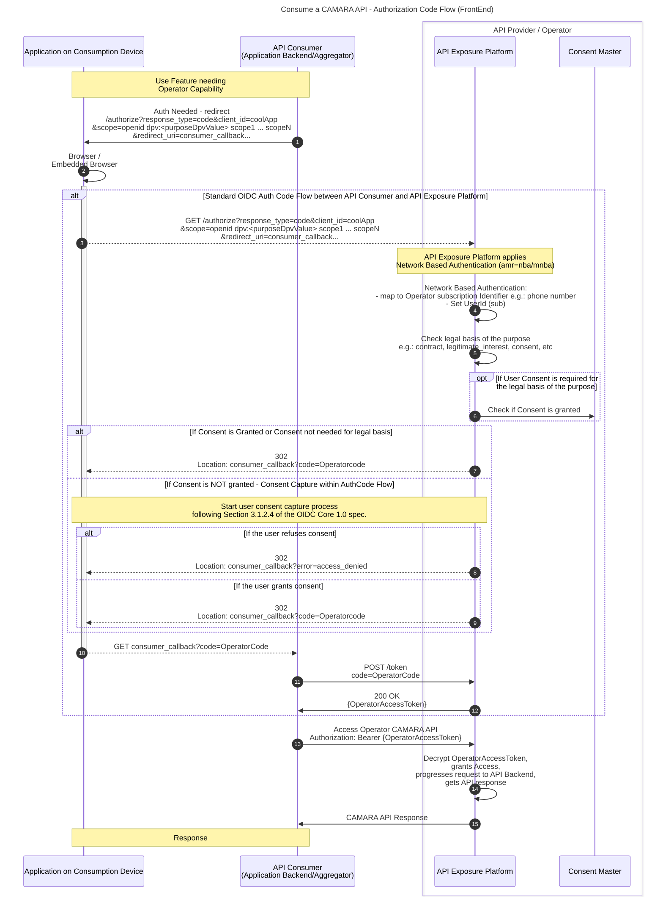
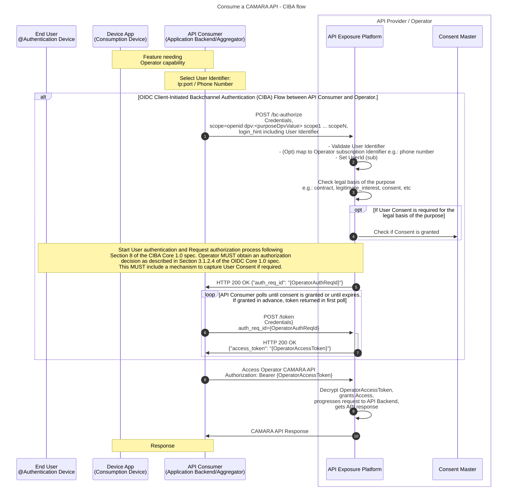
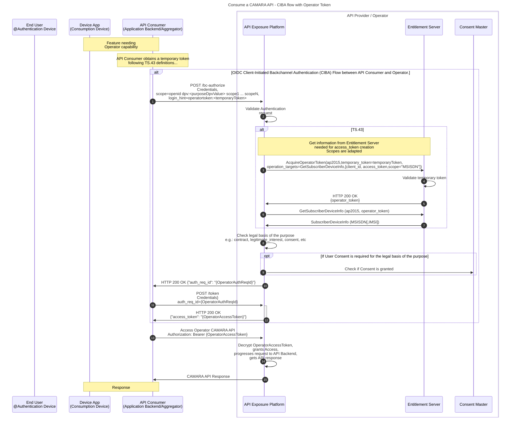
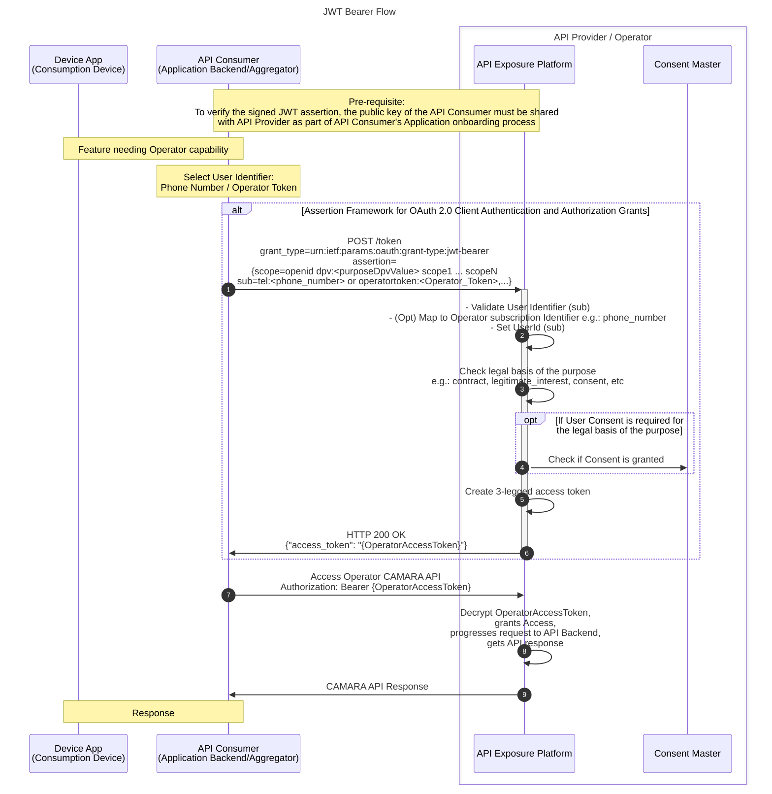
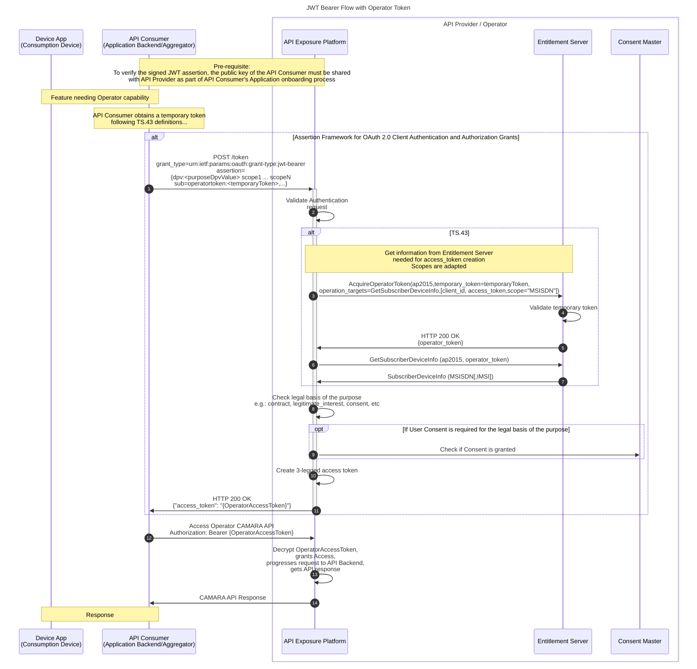

# CAMARA APIs Access and User Consent Management

This document defines guidelines for API Providers to manage CAMARA API access and when applicable, User Consent.

## Table of Contents

- [Introduction](#introduction)
- [Glossary of Terms and Concepts](#glossary-of-terms-and-concepts)
- [Purpose within CAMARA](#purpose-within-camara)
  - [Using Purpose within the authorization request](#using-purpose-within-the-authorization-request)
- [User Authentication/Authorization \& Consent Management](#user-authenticationauthorization--consent-management)
  - [Authorization flows / grant types](#authorization-flows--grant-types)
    - [Authorization Code Flow (Frontend Flow)](#authorization-code-flow-frontend-flow)
      - [Technical ruleset for the Frontend flow](#technical-ruleset-for-the-frontend-flow)
    - [CIBA flow (Backend flow)](#ciba-flow-backend-flow)
      - [Technical ruleset for the Backend flow](#technical-ruleset-for-the-backend-flow)
      - [CIBA flow with Operator Token](#ciba-flow-with-operator-token)
    - [Client Credentials](#client-credentials)
    - [JWT Bearer Flow](#jwt-bearer-flow)
      - [Technical ruleset for the JWT Bearer Flow](#technical-ruleset-for-the-jwt-bearer-flow)
      - [JWT Bearer flow with Operator Token](#jwt-bearer-flow-with-operator-token)
- [CAMARA API Specification - Authorization and authentication common guidelines](#camara-api-specification---authorization-and-authentication-common-guidelines)
  - [Use of openIdConnect for `securitySchemes`](#use-of-openidconnect-for-securityschemes)
  - [Use of `security` property](#use-of-security-property)
  - [Mandatory template for `info.description` in CAMARA API specs](#mandatory-template-for-infodescription-in-camara-api-specs)


## Introduction

Some CAMARA APIs process Personal Data and according to local regulations may require a “legal basis” to do so (e.g. "legitimate interest”, “contract”, “consent”). API Providers exposing CAMARA APIs should be built with a privacy-by-design approach to fully comply with any relevant data protection requirements and regulations, such as [GDPR](https://gdpr-info.eu/) in Europe.

CAMARA API access will be secured by the protocols described in the [CAMARA Security and Interoperability Profile](CAMARA-Security-Interoperability.md)
- [OpenID Connect Authorization Code Flow](CAMARA-Security-Interoperability.md#oidc-authorization-code-flow) (OIDC).
- [OpenId Connect Client-Initiated Backend Authentication](CAMARA-Security-Interoperability.md#client-initiated-backchannel-authentication-flow) (CIBA).
- [OAuth2 Client-Credentials Flow](CAMARA-Security-Interoperability.md#client-credentials-flow).
- [OAuth2 JWT Bearer Flow](CAMARA-Security-Interoperability.md#jwt-bearer-flow).

The concept common to all flows is that the access token used to invoke an API is created at the Authorization Server, and the API endpoint (Resource Server) grants access to the API based solely on the access token.
This separation of concerns places all responsibility for implementing legal and business concerns under the authority of the Authorization Server, freeing the Resource Server from the need to worry about them. The API Provider's developers implementing the API can focus on the API functionality itself, simplifying the Resource Server's implementation.

This document defines guidelines for the API Exposure Platform to manage CAMARA API access and when applicable, User Consent to comply with data protection requirements, and it introduces the formal concept of Purpose within an API invocation. Note that the document is predominantly based on concepts defined within GDPR regulations, however the proposed solution and concepts are generic and can by mapped to any relevant local data protection regulations.

This document includes following concepts:
- User identity, and how to identify the User.
- API Consumer authentication and authorization, and how to authenticate the Applications and authorize their access to CAMARA APIs.
- How Purpose applies to CAMARA APIs.
- How to capture and store Consent when required, without materially degrading the End-User's experience of an Application.
- Policy enforcement to validate the existence and/or validity of Consent before authorizing access to a CAMARA API.
- Revocation of Consent.

## Glossary of Terms and Concepts

The list below introduces several key concepts:

- `Aggregator`: the party that aggregates CAMARA APIs exposed by Operators, and exposes services that utilize these APIs to ASPs. An Aggregator can be a hyperscaler (e.g. Vonage, AWS, Azure, Google Cloud) offering its own services that consume CAMARA APIs, or exposing Operators' CAMARA APIs in an aggregated way, or an Operator acting as an Aggregator, i.e. an Operator aggregating other Operators' CAMARA APIs.
- `API Exposure Platform`: the Operator's platform for exposing CAMARA APIs to ASPs and Aggregators, providing authentication and authorization mechanisms, and End-User Consent management. The API Exposure Platform typically consists of at least an Auth Server and an API Gateway.
-	`Application` or `Application Backend`: the ASP's software services that access CAMARA APIs.
- `Application Service Provider (ASP)`: the Legal Entity that provides the Application and/or services that consume CAMARA APIs.
- `Authentication Device`: The device on which the user will authenticate/authorize the request, often a smartphone. As defined by [CIBA](https://openid.net/specs/openid-client-initiated-backchannel-authentication-core-1_0.html#terminology).
-	`Authorization (Auth) Server`: the authorization server processes requests from an Application to issue an access token upon successful authentication and authorization. The Auth Server provides OpenID Connect (OIDC) compliant endpoints, and is able to authenticate the User by validating the provided user identity with an Identity Provider; the Auth Server exposes the OIDC authorization endpoints and the OIDC token endpoint.
-	`Consent`: an explicit opt-in action that the User takes to allow processing of personal data. Consent grants a Legal Entity (e.g. the Operator or ASP) access to a set of Scopes related to the Resource Owner, for a specific Purpose.
- `Consumption Device`: the physical device on which an Application is installed or running.
-	`End-User`: the human participant using an Application on a Consumption Device, only applicable to some CAMARA APIs.
-	`Identity Provider (IdP)`: the OpenID Identity Provider, the party that provides authentication as a service (the IdP creates, maintains, and manages identity information).
-	`Legal Entity`: the legal subject that processes Personal Data for a specific Purpose.
- `Operator`: Mobile Network Operator (MNO), Communication Service Provider (CSP), or telco operator exposing network capabilities.
- `Personal Data` or `Personally Identifiable Information (PII)`: Data which may identify or relates to an individual as defined within the relevant regulatory framework; for example, this may include an individual's name or address.
-	`Purpose`: The reason for which Personal Data will be processed by an Application. For example, an Application might want to create a movie recommendation for an End-User using their Personal Data, such as age or gender. CAMARA defines a standard set of Purposes which can be used by Applications to specify the reason for their intended Personal Data processing.
-	`Resource Owner` or `User`: the End-User or Subscriber which Personal Data processed by a CAMARA API relates to, the Resource Owner has the authority to authorize access to CAMARA APIs which process Personal Data.
-	`Resource Server`: the server that exposes protected resources to Applications. The Resource Server requires a valid access token to be provided before allowing access to the protected resource.
-	`Scope`: the OpenID Connect scope which maps one or more protected resources, some scopes may require processing of Personal Data.
- `Subscriber`: the mobile subscriber of the Operator. The Subscriber is usually also the End-User, but this is not always the case. For example, a parent may be the Subscriber of a mobile subscription for their child, the End-User.
- `Target Device`: the device that is the primary resource (target) affected by an API call, and for which Consent may need to be obtained from the Resource Owner.
- `Three-Legged Access Token`: an access token that involves three parties: the Resource Owner (User), the Authorization Server (operated by the Operator or Aggregator), and the client (the ASP's Application). In CAMARA, Three-Legged Access Tokens are typically created using the OIDC Authorization Code flow, Client-Initiated Backchannel Authentication (CIBA) flow or OAuth2 JWT Bearer Flow.
- `Two-Legged Access Token`: an access token that involves two parties, the Authorization Server (operated by the Operator or Aggregator), and the client (the ASP's Application); the Two-Legged Access Token does not include a Resource Owner (User). The Authorization Server does not authenticate a User, nor can User Consent be captured or validated for Two-Legged Access Tokens; therefore Two-Legged Access Tokens must only be used for CAMARA APIs that do not process Personal Data.

## Purpose within CAMARA

The Purpose definition (naming + description) and format within CAMARA follows the W3C [Data Privacy Vocabulary](https://w3c.github.io/dpv/)​ (DPV).

### Using Purpose within the authorization request

Purpose must be specified in the authorization request for a CAMARA Three-Legged Access Token, this is achieved by extending the `scope` parameter as defined in [Purpose as a Scope](CAMARA-Security-Interoperability.md#purpose-as-a-scope) section of the CAMARA Security and Interoperability Profile.

## User Authentication/Authorization & Consent Management

**CAMARA User Authentication/Authorization & Consent Management follows the [CAMARA Security and Interoperability Profile](CAMARA-Security-Interoperability.md) technical specification**

### Authorization flows / grant types

This section describes the authorization flows that can be used to access CAMARA APIs:

* Authorization code flow (Frontend flow) - Used to obtain a Three-Legged Access Token from the Authorization Server and initiated from the Consumption Device
* CIBA flow (Backend flow) - Used to obtain a Three-Legged Access Token from the Authorization Server and initiated from the ASP's Application Backend
* Client Credentials - Used to obtain a Two-Legged Access Token from the Authorization Server
* JWT Bearer Flow - Used to obtain a Three-Legged Access Token from the Authorization Server using a JWT assertion as Authorization Grant, on behalf of the User.

Note: In cases where Personal Data is processed by a CAMARA API, and Users can exercise their rights through mechanisms such as opt-in and/or opt-out, the use of Three-Legged Access Tokens is mandatory.

#### Authorization Code Flow (Frontend Flow)



**Flow description**:

Firstly, the API Consumer (for example, the Application Backend) instructs the Application on the Consumption Device to initiate the OIDC Authorization Code Flow with the API Provider (for example, the Operator). The authorization request includes the client_id of the ASP's Application requesting access to the API and the Application's redirect_uri (consumer_callback) where the authorization code will be sent.

As per the standard authorization code flow, the Application is redirected to the Operator's Authorization Server in their API Exposure Platform (Steps 1-2), providing a redirect_uri (consumer_callback) pointing to the ASP's Application Backend (where the auth code will eventually be sent), as well as the Purpose for processing Personal Data.

The Operator's API Exposure Platform receives the request from the Application (Step 3) and does the following:

- Uses network based authentication to obtain the Subscriber's unique identifier,e.g.: phone number or IMSI. Sets the id_token sub to a unique user ID and associates the sub with the access token. The id_token sub MUST NOT reveal information to the Application, as authentication has not yet been performed. (Step 4).

- Checks if User Consent is required, which depends on the legal basis associated with the Scope and Purpose. If necessary, it will check in the Operator's Consent Master whether User Consent has already been given for this Application, Scope and Purpose (Steps 5-6).

Then, two alternatives may occur:

**Scenario 1**: User Consent is not required or User Consent has already been given (Step 7). The API Exposure Platform will continue the authorization code flow by redirecting to the Application's redirect_uri (consumer_callback) and including the authorization code (OperatorCode).

**Scenario 2**: Consent is required and has not yet been provided by the User (Step 8)

- The Operator performs the consent capture following Section 3.1.2.4 of the OpenID Connect Core 1.0 specification. Since the Authorization Code Grant involves the Consumption Device, Consent can be captured directly from the User - however this must be done in a manner that does not allow for background loading and acceptance by a malicious Application.
- Once the User has given Consent, the flow continues by redirecting to the Application's redirect_uri (consumer_callback) and including the authorization code (OperatorCode).

Once the Application receives the redirect with the authorization code (OperatorCode - Steps 9-10), it will retrieve the access token from the operator's API exposure platform (OperatorAccessToken) (Steps 11-12).

Now the Application has a valid access token that can be used to invoke the CAMARA API offered by the Operator (Step 13).

The Operator's API Exposure Platform will validate OperatorAccessToken, grant the access to the API based on the Scopes bound to the access token, progress the request to the corresponding API backend and retrieve the API response (Step 14).

Finally, the Operator will provide the API response to the Application (Step 15).

##### Technical ruleset for the Frontend flow

If all API use cases point to the need of an 'On-Net' scenario and where the Consumption Device and Authentication Device are the same, the Frontend flow SHOULD be used e.g. Number Verification.

This flow then enables On-Net scenarios where the mobile connection of the Consumption Device needs to be authenticated. For example, the [CAMARA Number Verification API](https://github.com/camaraproject/NumberVerification) due to the nature of its functionality where a User's phone number needs to be compared to the phone number associated with the mobile connection of the Consumption Device. 

The Application on the Consumption Device must be able to handle browser redirects.

  - Identity: 
    - Identification by IP address (or header enrichment).
  - AuthZ/AuthN:
    - Standard OAuth 2.0 Authorization Code Grant flow
    - Network based authentication.
      - Use network based authentication mechanism to obtain the user identifier, i.e.: phone number. Set the OAuth sub to the unique user ID in the operator.
    - Three-Legged Access Token. Each access session is associated with the Operator, a client_id (which must be the final application using the information) and the corresponding User identifier.
  - Consent management:
    - Check if User Consent is required as the lawful basis associated with the declared Scope and Purpose. 
      - If necessary, it will be checked in the operator's consent master whether user consent has already been given to the application for the user identifier and declared purpose.
    - If NOT granted, the operator performs the consent capture. Since the authorization code grant involves the interaction with application front-end, consent can be captured directly from the user through the application browser.
  - Covered scenarios: 
    - On-net (with mobile connection) & application front-end (with embedded browser)
    - Off-net scenarios using refresh_token, as long as there was a connection when the first access_token was requested.
    - Note: The Consumption Device must be equal to the Target Device of subsequent API call(s).


#### CIBA flow (Backend flow)


**Flow description**:
First, the API Consumer (e.g. Application Backend or Aggregator) requests a Three-Legged Access Token from the API Provider (for example, the Operator's API Exposure Platform). The process follows the OpenID Connect [Client-Initiated Backchannel Authentication (CIBA)](https://openid.net/specs/openid-client-initiated-backchannel-authentication-core-1_0.html) flow.

In the authorization request to the [Backchannel Authentication Endpoint](https://openid.net/specs/openid-client-initiated-backchannel-authentication-core-1_0.html#rfc.section.7) the API Consumer provides a login_hint with a valid User identifier together with the application credentials (the client_id of the Application requesting access to the data) and indicates the Purpose for processing Personal Data (Step 1). The login_hint formats for CAMARA and the way to declare a Purpose when accessing the CAMARA APIs is defined in the [CAMARA Security and Interoperability Profile](CAMARA-Security-Interoperability.md).

The Operator's API Exposure Platform will:

- Validate User identifier and map it to an Operator subscription identifier if applicable, e.g. map IP to phone number (The Authorization Server MUST process the hint provided to determine if the hint is valid and if it corresponds to a valid user). Set the OAuth sub to the unique user id (Step 2).

- Checks if User Consent is required, which depends on the legal basis associated with the Scope and Purpose. If needed, it will check in the Operator's Consent Master whether Consent has already been given, the Application client_id and the requested Purpose (Steps 3-4).

Subsequently, the Operator starts the User authentication and request authorization process following Section 8 of the CIBA Core 1.0 spec. Operator MUST obtain an authorization decision as described in Section 3.1.2.4 of the OIDC Core 1.0 spec. This MUST include a mechanism to capture User Consent if required. 

Note: The Operator retains the flexibility to determine the most suitable method for authorizing the request. This includes options ranging from initiating an interactive session on the user's authentication device to, based on their risk assessment and confidence level, authorizing the request based on the Personal Data being processed and the user identified by the login_hint without further user interaction (e.g. operator token scenario) or by any other means that the Operator deems appropriate, always in accordance with applicable law.

In parallel, the API Exposure Platform returns a 200 OK response with the CIBA auth request identifier (auth_req_id=OperatorAuthReqId) to the API Consumer to indicate that the authentication request has been accepted and is being processed. This is a unique identifier to identify the authentication request made by the Invoker (Step 5).

Then, the API Consumer polls the token endpoint by making an "HTTP POST" request by sending the grant_type (`urn:openid:params:grant-type:ciba`) and auth_req_id (OperatorAuthReqId) parameters (Step 6).

- The API Consumer will receive the following error code if the authorization is still pending to be accepted or rejected by the user.
    
    ```
    HTTP/1.1 400 Bad Request
    Content-Type: application/json
    
    {
        "error": "authorization_pending",
    }
    ```
- When this response is received, the API Consumer must wait the seconds of the `interval` value received in the CIBA authorization endpoint and then repeat the request until a final response is received.
- Once the User has given Consent, the API Exposure Platform will provide the access token (OperatorAccessToken) to the API Consumer (Step 7).

Now the API Consumer has a valid access token that can be used to invoke the CAMARA API offered by the operator (Step 8).

Finally, the Operator will validate the OperatorAccessToken, grant access to the API based on the Scopes bound to the access token, forward the request to the corresponding API backend and retrieve the API response (Step 9).

The Operator will provide the API response to the API Consumer (Step 10).

##### Technical ruleset for the Backend flow

If the API use case(s) indicate the need for an "Off-net" scenario and/or if the Consumption Device and Authentication Device are different, the Backend flow (CIBA) SHOULD be used.
Also note that in the case of the CIBA flow, it is applicable if the Consumption Device is the same or different from the Target Device of the intended CAMARA API call(s).

  - Identity: 
    - Identification by IP, phone number or others like IMSI, ICCID for specific use cases.
  - AuthZ/AuthN:
    - Standard OIDC backend-based flow: CIBA.
    - Three-Legged Access Token. Each access session is associated with the Operator, a client_id (which must be the final application using the information) and the corresponding User identifier.
  - Consent management:
    - Check if user consent is required by lawful basis associated with the declared purpose. 
      - If necessary, it will be checked **in the operator's consent master** whether user consent has already been given to the application for the user identifier and declared purpose.
      - If NOT granted, **the operator’s consent capture procedure is triggered**. Out-of-band consent capture as part of asynchronous CIBA flow (e.g. push notification with fallback to SMS, etc...). **Operators can choose the consent capture mechanism that best suits their capabilities, preferences and needs**.
  - Covered scenarios: 
    - No front-end developer software in user device
    - Back-end services (e.g. bank BE anti-fraud validation using phone number).
    - Off-net scenarios (no mobile connection)
    - Device connected to WiFi
    - Device without UI (IoT)
    - Note: Consumption device and target device of subsequent API call(s) can be different, access token is generated for the target device

##### CIBA flow with Operator Token

This section provides an example of the CIBA flow involving an Operator Token, which is a specific case of the CIBA flow where the login_hint provided by the API Consumer is a temporary token (a TS.43 token). The presence of a TS.43 token confirms the Subscriber's prior authentication. In this case, the API Consumer sends the temporary token to their backend which sends a CIBA Authentication Request with a parameter `login_hint=operatortoken:<temporaryToken>`. The process by which API Consumers obtain a TS.43 token from the Entitlement Server using EAP-AKA SIM-based authentication, how this token is sent to their backend, and how the API Provider subsequently validates the temporary token with the Entitlement Server, are beyond the scope of this document. API Consumers must follow the TS.43 definitions to obtain the temporary token.



Note: The interaction between the API Exposure Platform (Authentication Server) and the Entitlement Server is just an illustrative example, not a normative one. The Entitlement Server MUST validate the temporary token when performing a TS.43 operation like GetPhoneNumber, VerifyPhoneNumber, GetSubscriberDeviceInfo or AcquireOperatorToken. 

The above flow example assumes a use case where Consent is not required, such as legitimate interest. In this case, the Operator Token is used for 'silent' authentication of the User (i.e. with no User interaction), where the API Consumer has already obtained the temporary token from the Entitlement Server using EAP-AKA SIM-based authentication, which is transparent to the User.

#### Client Credentials

The [OAuth 2.0 Client Credentials](https://datatracker.ietf.org/doc/html/rfc6749#section-4.4) grant type is used to obtain a Two-Legged Access Token that does not represent a User. More details about what CAMARA defines for this grant type and it's usage can be found in the [CAMARA Security and Interoperability Profile](CAMARA-Security-Interoperability.md).

#### JWT Bearer Flow

The [OAuth 2.0 JWT Bearer](https://datatracker.ietf.org/doc/html/rfc7523) flow is used to obtain a Three-Legged Access Token that represents a User, using a JWT assertion as Authorization Grant, on behalf of the User. More details about what CAMARA defines for this grant type and its usage can be found in the [CAMARA Security and Interoperability Profile](CAMARA-Security-Interoperability.md).




**Flow description**:

The JWT Bearer Flow enables an API Consumer (typically the Application Backend or Aggregator) to obtain a Three-Legged Access Token from the API Provider (Operator) by presenting a signed JWT assertion on behalf of the User. The flow proceeds as follows:

**Pre-requisite:** The API Consumer must share its public key with the API Provider during onboarding, so the API Provider can verify the signature of the JWT assertion.

The API Consumer selects the User Identifier. The User is identified by the `sub` claim in the JWT assertion, which must uniquely identify the User in the Operator's system. As per the CAMARA Security and Interoperability Profile, the `sub` claim MUST be either a phone number prefixed by "tel:" or a TS.43 token prefixed by "operatortoken:".

Example JWT assertion, which MUST be signed by the API Consumer and MAY be encrypted:

```json
{
  "iss": "client_id",
  "sub": "operatortoken:ey...",
  "aud": "https://az.api-provider.com/token.oauth2",
  "exp": 1504807731,
  "iat": 1504804131,
  "jti": "53f42eb1-b751-44b5-bada-6990e08f35ac",
  "scope": "openid dpv:FraudPreventionAndDetection number-verification:device-phone-number:read"
}
```

The API Consumer sends a POST request to the API Exposure Platform's token endpoint (Step 1), using the `urn:ietf:params:oauth:grant-type:jwt-bearer` grant type and including the signed JWT assertion. The assertion contains the required claims: `iss` (client_id), `sub` (Identifying the User; the presence of a TS.43 Operator Token confirms the Subscriber's prior authentication.), `aud` (token endpoint URL), `exp`, `iat`, `jti`, and `scope` (including the declared Purpose and CAMARA scopes).

Example Token Request:

```
POST /token.oauth2 HTTP/1.1
Host: as.example.com
Content-Type: application/x-www-form-urlencoded

grant_type=urn%3Aietf%3Aparams%3Aoauth%3Agrant-type%3Ajwt-bearer
&assertion=eyJhbGciOiJFUzI1NiIsImtpZCI6IjE2In0.
eyJpc3Mi[...omitted for brevity...].
J9l-ZhwP[...omitted for brevity...]
```

Then the API Exposure Platform validates the JWT assertion (Steps 2-4):
  - Verifies the signature using the API Consumer's public key.
  - Validates the User Identifier and, if needed, maps it e.g. to the Operator's internal subscription identifier.
  - Checks the legal basis for the requested Purpose (e.g., contract, legitimate interest, consent).
  - If User Consent is required for the Purpose, the Consent Master is consulted to verify that consent has been granted.

If all validations succeed, the API Exposure Platform issues a Three-Legged Access (Step 5) Token and returns it to the API Consumer (Step 6).

The API Consumer uses the access token to invoke the CAMARA API, including it in the Authorization header (Step 7).

The API Exposure Platform validates and decrypts the access token, authorizes access, forwards the request to the API backend, and returns the API response to the API Consumer (Steps 8-9).

##### Technical ruleset for the JWT Bearer Flow

In case of Backend-to-backend scenarios where no user interaction is required (e.g. Legitimate Interest), and the User Identifier is known (e.g. TS.43 Operator Token), the JWT Bearer Flow should be used.

- Identity:
  - The User is identified by the `sub` claim in the JWT assertion, which must be either a phone number (`tel:`) or an Operator Token (`operatortoken:`), as per CAMARA Security and Interoperability Profile.
- AuthZ/AuthN:
  - Standard OAuth2 JWT Bearer flow.
  - Backend-based flow, where the API Consumer acts on behalf of a User using a JWT assertion as Authorization Grant.
  - Three-Legged Access Token. Each access session is associated with the Operator, a client_id (which must be the final application using the information) and the corresponding User identifier.
- Consent management:
  - Check if user consent is required by lawful basis associated with the declared purpose.
    - If necessary, it will be checked **in the operator's consent master** whether user consent has already been given to the application for the user identifier and declared purpose.
    - If NOT granted, the API Provider returns an error response indicating that Consent is required, and the API Consumer must handle the Consent capture process.
- Covered scenarios:
  - Backend-to-backend integrations where the API Consumer acts on behalf of a User, and the User Identifier is known.
  - Use cases where direct user interaction is not required at the time of the request because consent is not required or has already been obtained.

##### JWT Bearer flow with Operator Token

This section provides an example of the JWT Bearer flow involving an Operator Token, which is a specific case of the JWT Bearer flow where the `sub` claim in the JWT assertion is a temporary token (a TS.43 token). The presence of a TS.43 token confirms the Subscriber's prior authentication. In this case, the API Consumer sends the temporary token to their backend, which then sends a JWT Bearer Token Request to the API Provider with a JWT assertion where the `sub` claim is set to `operatortoken:<temporaryToken>`. The process by which API Consumers obtain a TS.43 token from the Entitlement Server using EAP-AKA SIM-based authentication, how this token is sent to their backend, and how the API Provider subsequently validates the temporary token with the Entitlement Server, are beyond the scope of this document. API Consumers must follow the TS.43 definitions to obtain the temporary token.



Note: The interaction between the API Exposure Platform (Authentication Server) and the Entitlement Server is just an illustrative example, not a normative one. The Entitlement Server MUST validate the temporary token when performing a TS.43 operation like GetPhoneNumber, VerifyPhoneNumber, GetSubscriberDeviceInfo or AcquireOperatorToken.

## CAMARA API Specification - Authorization and authentication common guidelines

The purpose of this document section is to standardise the specification of `securitySchemes` and `security` across all CAMARA API subprojects with common mandatory guidelines as agreed by the Technical Steering Committee (TSC) and the participants of this Working Group.

CAMARA guidelines define a set of authorization flows which can grant API Consumers access to the API.
Which specific authorization flows are to be used will be determined during the onboarding process, happening between the API Consumer (the direct API Consumer) and the API Provider exposing the API. When API access for an API Consumer is ordered, the declared Purpose for accessing the API can be taken into account. This is also being subject to the prevailing legal framework dictated by local legislation and eventually also considers the capabilities of the application (frontend and backend) ultimately involved in the API invocation flow. 
The authorization flow to be used will therefore be settled when the API access is ordered. 
The API Consumer is expected to initiate the negotiated authorization flow when requesting ID & access tokens. The Auth Server is responsible to validate that the authorization flow negotiated between API Consumer and API Provider for this application, purpose, API/data scopes is applied.

### Use of openIdConnect for `securitySchemes`

In general, OpenID Connect (OIDC) is the protocol to be used for securitization. Each API specification must only define the following openIdConnect entry in `securitySchemes`, as shown below:

```
components:
  securitySchemes:
    openId:
      type: openIdConnect
      openIdConnectUrl: https://example.com/.well-known/openid-configuration
```

The value for `openIdConnectUrl` in the CAMARA spec is an example, that must be substituted by the specific discovery endpoint for OIDC protocol of the API provider, when the API is exposed in one of its environments.

### Use of `security` property

Generally, each operation is protected by a scope and it will include a security property with a single element in the array:

```
paths:
  {path}:
    {method}:
      ...
      security:
        - openId:
            - {scope}
```
The key is arbitrary in OAS, but the convention in CAMARA is to name it `openId`. This key must be same defined in the `components.securitySchemes` section.

The {scope} is the specific scope defined to protect this operation.

### Mandatory template for `info.description` in CAMARA API specs

The documentation template below must be used as part of the API documentation in `info.description` property in the CAMARA API specs:

```
# Authorization and authentication

The "Camara Security and Interoperability Profile" provides details of how an API consumer requests an access token. Please refer to Identity and Consent Management (https://github.com/camaraproject/IdentityAndConsentManagement/) for the released version of the profile.

The specific authorization flows to be used will be agreed upon during the onboarding process, happening between the API consumer and the API provider, taking into account the declared purpose for accessing the API, whilst also being subject to the prevailing legal framework dictated by local legislation.

In cases where personal data is processed by the API and users can exercise their rights through mechanisms such as opt-in and/or opt-out, the use of three-legged access tokens is mandatory. This ensures that the API remains in compliance with privacy regulations, upholding the principles of transparency and user-centric privacy-by-design.
```

This statement informs potential API customers why the API specification does not list specific grant types and how to find out which authorization flows they can use.
